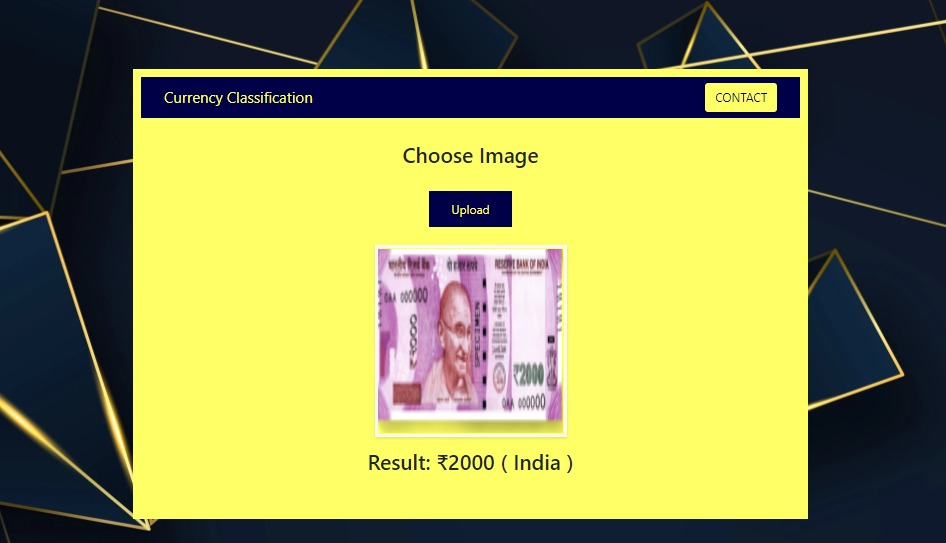
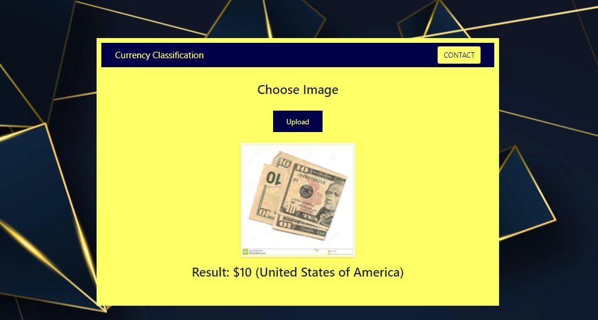
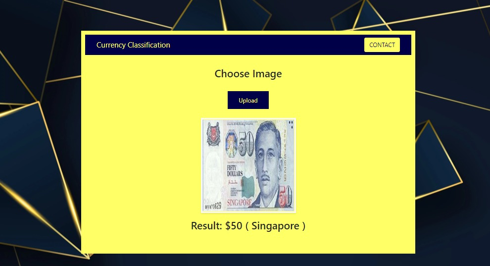

# Currency_Prediction
 
Image Classification Model which predicts the Denomination and country,given an Image as input

Custom Dataset created using Data Augumentation Techniques,
Architecture - VGG-19,
Accuracy of 80% achieved on initial training, to overcome  overfitting added more data to the dataset and trained the model and accuracy of 86% achieved after tuning the model and deployed the model to production using Flask Framework

Demo :

